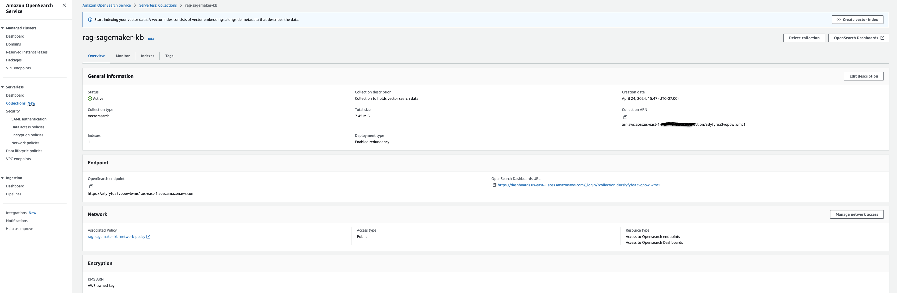
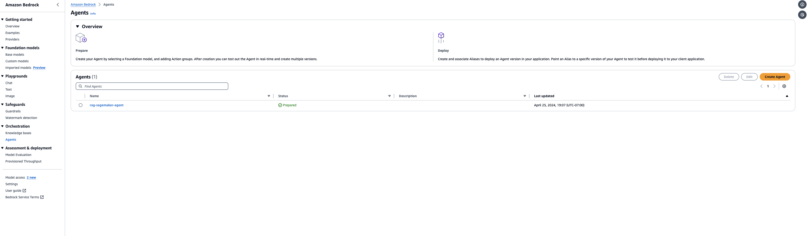

# Bedrock Knowledgebase Agent Workload Iac

# Title

Quickly deploy a serverless RAG application using Amazon Bedrock KnowledgeBase , Amazon Bedrock agents and OpenSearch Serverless. 

# Introduction

In today's fast-paced digital landscape , the role of Generative AI chatbots has become increasingly vital. 
Retrieval-Augmented Generation (RAG) is the process of optimizing the output of a large language model, so it references an authoritative knowledge base outside of its training data sources before generating a response. Large Language Models (LLMs) are trained on vast volumes of data and use billions of parameters to generate original output for tasks like answering questions, translating languages, and completing sentences. RAG extends the already powerful capabilities of LLMs to specific domains or an organization's internal knowledge base, all without the need to retrain the model. It is a cost-effective approach to improving LLM output so it remains relevant, accurate, and useful in various contexts.

Chatbot development typically begins using a foundation model. Foundation models (FMs) are API-accessible LLMs trained on a broad spectrum of generalized and unlabeled data. The computational and financial costs of retraining FMs for organization or domain-specific information are high. [RAG](https://aws.amazon.com/what-is/retrieval-augmented-generation/) is a more cost-effective approach to introducing new data to the LLM. It makes generative artificial intelligence (generative AI) technology more broadly accessible and usable. 

In this post , we will deploy an enterprise grade Q&A,  Serverless RAG application using Amazon Bedrock agents, Amazon Bedrock KnowledgeBase and OpenSearch Serverless and Amazon Titan Text Embeddings V1. 
To equip FMs with up-to-date and proprietary information, organizations use Retrieval Augmented Generation (RAG), a technique that fetches data from company data sources and enriches the prompt to provide more relevant and accurate responses. Knowledge Bases for Amazon Bedrock is a fully managed capability that helps you implement the entire RAG workflow from ingestion to retrieval and prompt augmentation without having to build custom integrations to data sources and manage data flows.
[Knowledge Bases](https://aws.amazon.com/bedrock/knowledge-bases/) gives you a fully managed RAG experience and the easiest way to get started with RAG in Amazon Bedrock. Knowledge Bases now manages the initial vector store setup, handles the embedding and querying, and provides source attribution and short-term memory needed for production RAG applications. If needed, you can also customize the RAG workflows to meet specific use case requirements or integrate RAG with other generative artificial intelligence (AI) tools and applications. 
[Agents for Amazon Bedrock](https://aws.amazon.com/bedrock/agents/) creates a prompt from the developer-provided instructions (E.g., “You are an insurance agent designed to process open claims”), API details needed to complete the tasks, and company data source details from knowledge bases. The automatic prompt creation saves weeks of experimenting with prompts for different FMs.

In this proposed solution , the Amazon Bedrock KnowledgeBase agent ingests the text corpus, which represents an enterprise knowledge base and is stored as HTML files in Amazon S3, into an index in an Amazon OpenSearch Serverless collection in the form of text embeddings. 

This repository sample consists of 2 Cloudformation templates to provision all the resources required to deploy the application end-end. 
The implementation consists an Amazon S3 as the datasource which stores your data that needs to be ingested into a knowledge base i.e. a vector database such as Amazon OpenSearch Service Serverless (AOSS). This will make it possible to lookup when a question is received.

# Solution Overview

The information is stored as HTML files within an S3 bucket, serving as the primary data source for the Amazon Bedrock Knowledge Base. Subsequently, the Bedrock knowledge base agent reads and break down these files into smaller segments, encoding them into vectors using Amazon Titan Text Embeddings V1. The encoded segments are stored as index within an OpenSearch Serverless Collection. The RAG functionality is applied within the console, enabling questions to posed to the Claude Model based on the documents retrieved from OpenSearch Serverless using RAG approach. 

The following figure represents the high-level architecture of the proposed solution : 

{#fig-architecture}

As illustrated in the architecture diagram, we use the following AWS
services:

- [Bedrock](https://aws.amazon.com/bedrock/) for access to the FMs for
  embedding and text generation as well as for the knowledge base agent.
- [OpenSearch Service Serverless with vector
  search](https://aws.amazon.com/opensearch-service/serverless-vector-engine/)
  for storing the embeddings of the enterprise knowledge corpus and
  doing similarity search with user questions.
- [S3](https://aws.amazon.com/pm/serv-s3/) for storing the raw knowledge
  corpus data (HTML files).
- [AWS Identity and Access Management](https://aws.amazon.com/iam/)
  roles and policies for access management.
- [AWS CloudFormation](https://aws.amazon.com/cloudformation/) for
  creating the entire solution stack through infrastructure as code.

# Deployment Guide 

In the following sections, we discuss the key steps to deploy the solution, including pre-deployment and post-deployment.

# Pre-Deployment
An AWS account to deploy the resources. Please use the link to sign-up if you do not have an account [AWS
account](https://signin.aws.amazon.com/signin?redirect_uri=https%3A%2F%2Fportal.aws.amazon.com%2Fbilling%2Fsignup%2Fresume&client_id=signup)

Clone the repository using the command 
git clone <Paste the REPOSITORY URL>

# Deployment Steps
The solution deployment automation script uses two parameterized CloudFormation template, OpenSearch_serverless.yml and AmazonBedrock_kb_agents.yml, to automate provisioning of following solution resources:

 1. OpenSearch Service Serverless collection
 2. Amazon S3 Bucket (DataSource)
 3. Amazon Bedrock KnowledgeBase
 4. Amazon Bedrock Agent
 5. IAM Roles

# Cloudformation to deploy OpenSearch_serverless.yml stack
AWS CloudFormation prepopulates stack parameters with the default values provided in the template except for ARN of the IAM role with which you are
currently logged into your AWS account which you’d have to provide. To provide alternative input values, you can specify parameters as environment variables that are referenced in the `ParameterKey=<ParameterKey>,ParameterValue=<Value>` pairs in the following shell script’s `aws cloudformation create-stack --stack-name <stack-name> --template-body file://OpenSearch_serverless.yml --parameters ParameterKey=<parameter key>,ParameterValue=<parameter value> ParameterKey=<parameter key>,ParameterValue=<parameter value>` ....

**Currently the stack can only be deployed in us-east-1 and us-west-2**

Once the Cloudformation stack creation is successful navigate to the Output section of the stack and grab the following output values AmazonBedrockExecutionRoleForKnowledgeBasearn , AOSSIndexName, CollectionArn,DataSource(S3 bucket name), S3bucketarn. We will use these values as parameters for our next stack AmazonBedrock_kb_agents.yml to deploy Amazon Bedrock Knowledgebase and agents.

# Create Vector index in OpenSearch Serverless
The previous CloudFormation stack creates OpenSearch Service Serverless collection,but the next step will require us to create a vector index in OpenSearch Service Serverless collection. Follow the steps outlined below : 

1.  Navigate to OpenSearch Service console and click on `Collections`.
    The `rag-sagemaker-kb` collection created by the CloudFormation stack
    will be listed there.

    <figure>
    
    <figcaption aria-hidden="true">Figure 3: SageMaker Knowledge Base
    Collection</figcaption>
    </figure>

2.  Click on the `rag-sagemaker-kb` link to create a vector index for
    storing the embeddings from the documents in S3.

    <figure>
    
    <figcaption aria-hidden="true">Figure 4: SageMaker Knowledge Base Vector
    Index</figcaption>
    </figure>

3. Grab the vector index name from the output values of the previous stack, the default value is`rag-sagemaker-readthedocs-io`. Input the vector
    field name as `vector` dimensions as `1536`, choose  engine types as `FAISS` and distance metric as
    `Euclidean`. **It is required that you set these parameters exactly
    as mentioned here because the Bedrock Knowledge Base Agent is going
    to use these same values**.
  
   <figure>
    
    <figcaption aria-hidden="true">Figure 5: SageMaker Knowledge Base Vector
    Index Parameters</figcaption>
    </figure>

4.  Once created the vector index is listed as part of the collection.

    <figure>
    
    <figcaption aria-hidden="true">Figure 6: SageMaker Knowledge Base Vector
    Index Created</figcaption>
    </figure>

# CloudFormation to deploy AmazonBedrock_kb_agents.yml

Deploy the next stack using the following commands to provision the resources in your AWS account. 

`aws cloudformation create-stack --stack-name <stack-name> --template-body file://AmazonBedrock_kb_agents.yml --parameters ParameterKey=<parameter key>,ParameterValue=<parameter value> ParameterKey=<parameter key>,ParameterValue=<parameter value>` ....

**Note** , grab the values of parameters from the output of the previous stack.Use these keys, **AmazonBedrockExecutionRoleForKnowledgeBasearn , AOSSIndexName, CollectionArn,DataSource(S3 bucket name), S3bucketarn** and the corresponding output values from previous stack to pass it as parameters when you are trying to create the 2nd stack 

# Test the RAG App in Amazon Bedrock Agents Console.

1. Navigate to Amazon Bedrock console and click on `Agents`
The `rag-sagemaker-agent` knowledgebase agent created by the CloudFormation stack
    will be listed there.

   <figure>
    
    <figcaption aria-hidden="true">Figure 3: SageMaker Knowledge Base
    Collection</figcaption>
    </figure>
    
2. Click on the `rag-sagemaker-agent` to open it and ask the following questions to the agent using console.
    <figure>
    
    <figcaption aria-hidden="true">Figure 21: Agent console</figcaption>
    </figure>
3. Lets ask the agent a question such as `Tell me something about Amazon SageMaker Conditional Step`. Note that besides providing with the correct answer , the agent shares the correct documentation details that is stored in the S3 bucket which has been used to deduce the answer.

 <figure>
    
    <figcaption aria-hidden="true">Figure 22: Q&amp;A with Bedrock
    Agent</figcaption>
    </figure>

4. Also notice that the each response from an Amazon Bedrock agent is accompanied by a **trace** that details the steps being orchestrated by the agent. The **trace** helps you follow the agent's reasoning process that leads it to the response it gives at that point in the conversation.

Use the **trace** to track the agent's path from the user input to the response it returns. The trace provides information about the inputs to the action groups that the agent invokes and the knowledge bases that it queries to respond to the user.

**Note** if the Agent is taking time to generate recommendations , navigate to Amazon Bedrock Knowledge bases and resync the data source and try again.

# Deploy the Agent
In this workshop we have deployed a working draft version(DRAFT). To deploy the agent into your application , follow the steps here : 
https://docs.aws.amazon.com/bedrock/latest/userguide/agents-deploy.html

## Clean up

To avoid incurring future charges, delete the resources. You can do this
by first deleting all the files from the S3 bucket created by the
CloudFormation template and then deleting the CloudFormation stack.

## Conclusion

In this codesample, we demonstrated how to create an enterprise ready RAG solution
using a combination of AWS services and CloudFormation. 

